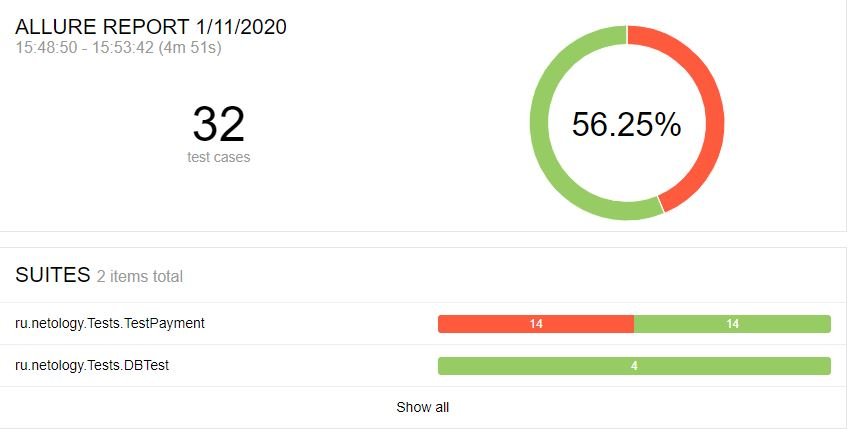

# Отчет по итогам тестирования

### Краткое описание
* В ходе автоматизации тестирования были реализованы позитивные и негативные сценарии заполнения тестовой страницы
* Реализована поддержка двух БД - MySQL и PostgreSQL

* Автоматизация тестирования сервиса "Путешествие дня" выполнялась с использованием следующих инструментов:
    * Intellij IDEA 2019.3.1 (Community edition)
    * Java 8 
    * Docker desktop community 2.1.0.5
    * junit-jupiter: 5.5.1
    * selenide: 5.6.0
    * rest-assured: 4.1.2
    * allure 2.13.1
    * faker 1.0.1

Для работы с БД и симулятором банковских сервисов использовался docker

Были протестированы сценарии:
* Успешная покупка с дебетовой и кредитной карты
* Отказ банка с дебетовой и кредитной картой
* Негативные проверки полей: невалидные значения, незаполненные поля
* Проверка записи данных в БД при использовании MySQL и PostgreSQL

### Количество тест-кейсов

* Всего: 32 тест-кейсов
* Успешных: 18 (56%)
* Неуспешных: 14 (44%)

### Общие рекомендации

#### Найденные баги

* [При пустом поле cvc/cvv предупреждающая надпись возникает у поля Владелец](https://github.com/VEAlekseev/Diploma/issues/4)
* [Поле Владелец допускает ввод символов, не являющихся буквами](https://github.com/VEAlekseev/Diploma/issues/2)
* [Поле обязательно для заполнения появляется только у поля Владелец](https://github.com/VEAlekseev/Diploma/issues/3)
* [Отсутствует валидация номера карты кроме размера](https://github.com/VEAlekseev/Diploma/issues/5)
* [Поле Владелец допускает ввод кириллических символов](https://github.com/VEAlekseev/Diploma/issues/6)
* [Ошибка в слове Марракеш ](https://github.com/VEAlekseev/Diploma/issues/7)
* [Заголовок страницы не соответствует содержанию](https://github.com/VEAlekseev/Diploma/issues/8)
* [При совершении операции покупки неизвестной картой появляются два сообщения: об ошибке и успешной операции](https://github.com/VEAlekseev/Diploma/issues/9)
* [При вводе данных неактивной (DECLINE) карты производится операция покупки](https://github.com/VEAlekseev/Diploma/issues/10)

#### Рекомендации по улучшению интерфейса

* Создать спецификацию для данного приложения
* Исправить орфографическую ошибку в слове "Марракэш". Правильно - Марракеш.
* Реализовать валидацию номера карты, кроме размера.
* Реалиовать валидацию имени владельца карты (запретить ввод всего кроме латиницы и задать минимальный размер букв).
* Во всех случаях, когда поля формы остаются не заполненными, реализовать появление предупреждающей надписи "Поле обязательно для заполнения" вместо "Неверный формат". На данный момент тестирование организовано с учетом имеющихся предупреждающих надписей.
* Возможно, была бы удобной опция сохранять данные в анкете при переключении между функциями "Купить" и "Купить в кредит". Сейчас анкета очищается каждый раз.
* Изменение заголовка страници на актуальное название.
